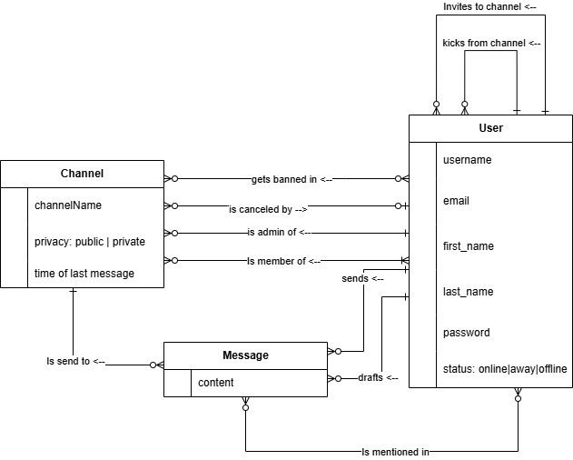
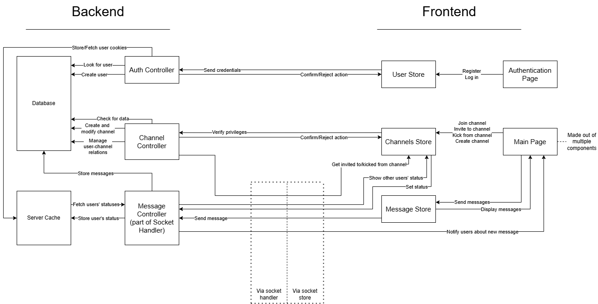
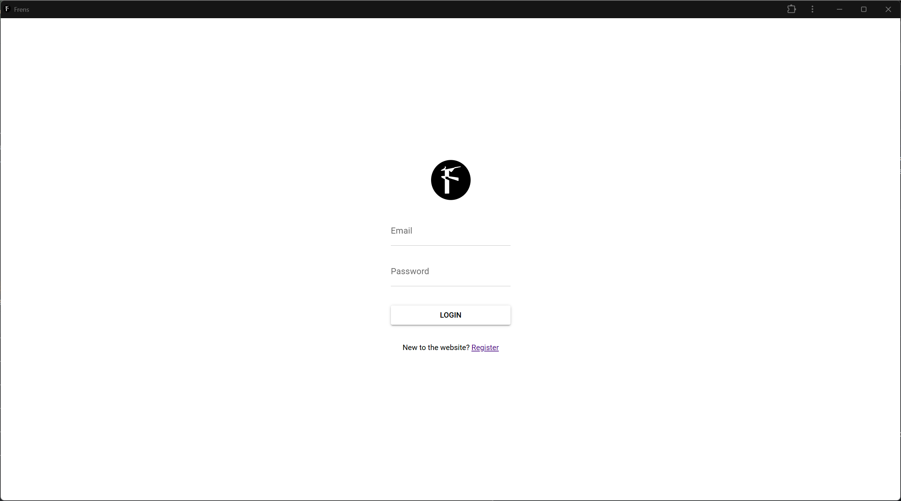
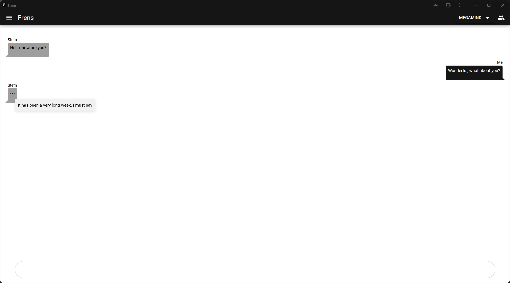
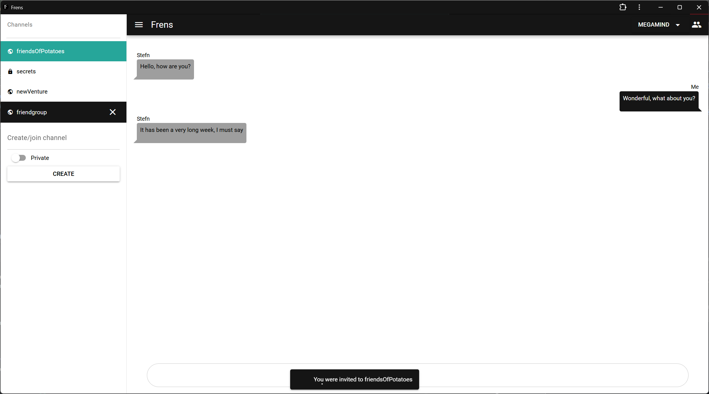
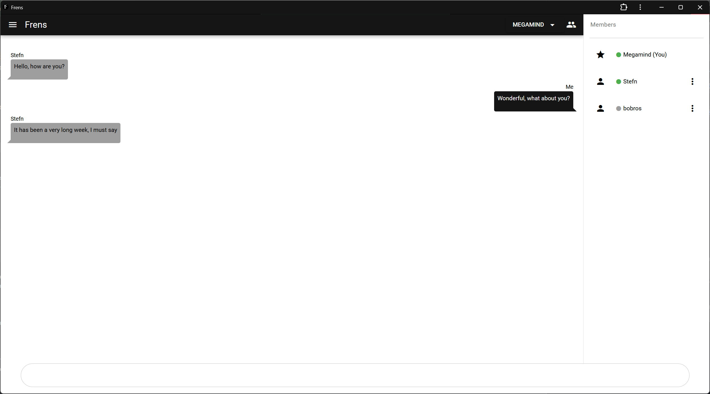
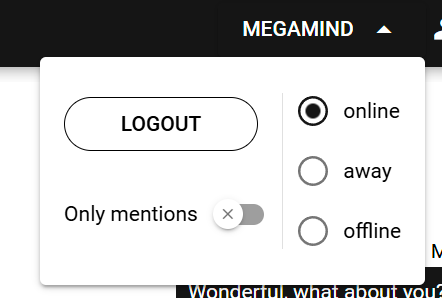

# Zadanie
Vytvorte progresívnu webovú aplikáciu na textovú komunikáciu v štýle IRC (Slack), ktorá komplexne rieši nižšie definované prípady použitia.
# Diagram fyzického dátového modelu

# Diagram architektúry

# Návrhové rozhodnutia
## Odporúčané knižnice
### Quasar
Quasar je veľmi obsiahla knižnica, ktorá obsahuje veľa komponentov a funkcionalít, ktoré sa nám hodia. Medzi ne patria:
* komponenty pre UI
  * tlačidlá, vstupné polia,...
* Notifikácie
  * Jednoduché q.notify, ktoré sa zobrazuú keď používateľ používa aplikáciu
* PWA mód
  * jednoduché pretvorenie SPA na PWA
### Adonis
Z Adonis.js sme v projekte využili:
* autentifikácia/autorizácia
* Lucid ORM - migrácie, modely a controllers
* http server
### PostgreSQL
* relačná databáza využivaná cez Lucid ORM
## Externé knižnice
### Pinia
Na spravovanie stavov sme zvolili Piniu namiesto Vuex, nakoľko Vuex je deprecated a nebude podporovaný v budúcnosti.
### Vymazávanie neaktívnych kanálov
```npm install node-schedule```  
Použitá knižnica node-schedule, kvôli jednoduchej implementácii.  
Stačí zavolať schedule.scheduleJob('sek min hod deň_v_mesiaci mesiac_v_roku deň_v_týždni', funkcia()), kde nepoužité hodnoty nahradíme *.

### Websocket
```npm install ws```
Použitá knižnica ws na backend pre komunikáciu s klientom.
## Socket pripojenie
Pre socket pripojenie s používateľským kontextom v Adonis 6 sme implementovali vlastné riešenie, keďže sme nenašli vhodnú knižnicu. Na frontende sme použili WebSocket API prehliadača a na backende knižnicu `ws`.

### Postup autentifikácie
1. Klient pošle HTTP request na `/authWS`.
2. Vygeneruje sa unikátny token, ktorý sa spolu s používateľským objektom uloží do `PendingWebSocketAuthentificationRequest`. Token sa vráti v odpovedi na request.
3. Klient vytvorí WebSocket pripojenie na WebSocket server a pošle token ako správu na server.
4. WebSocket server autentifikuje token a priradí používateľskú session k socketu, čím identifikuje pripojeného používateľa.

Pre každé pripojenie socket server vytvorí novú inštanciu triedy `SocketSession`, ktorá spracúva socket správy.

## Strat/Nadobudnutie internetového pripjenia.
Jednoducho sme to riešili, tak že keď internetové pripojenié sa stratí, presmeruje sa na login screen z errorom. A následne pri nadobudnutí pripojenia, ak je user už prihlásený tak sa automatický presmeruje na hlavnú obrazovku.

## Push notifikácie
Push notifikácie sme riešili pomocou už existujúceho Notification API, ktorý je dostupný v prehliadačoch. Notifikacie sa iba zašľu ak že AppVisibility je false, teda ak je aplikácia v pozadí. Inak za zašle Quasar notifikácia. Implementácia je v `notifications.ts` 


 
# Snímky obrazoviek
## Prihlasovacia obrazovka

## Konverzácia v kanáli

## Pozvánka do kanála

## Zoznam členov kanála

## Nastavenia


